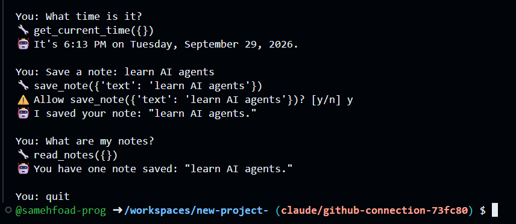
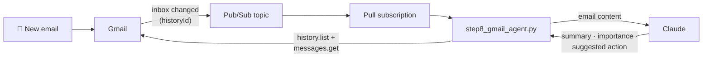

# 🤖 AI Agents with Claude: from first API call to event-driven automation


[](https://www.linkedin.com/in/samehbasaly)

A hands-on project in which I build AI agents in Python with Anthropic's Claude,
step by step: from a single API call, to an agent that uses tools, to tools
served over **MCP**, to an agent that **wakes up by itself when a new email
arrives** in Gmail.

Every step is a small runnable file, so the project doubles as a tutorial
that others can follow.

## 🎬 Demo

A chat agent that tells the time, saves notes, and **asks for approval** before
changing anything:



## ✨ Features

- **Agent loop from scratch.** Claude decides which tool to use, the code runs it, and the loop continues until the task is done.
- **Human-in-the-loop safety.** Actions that change data require an explicit `y/n` approval.
- **Conversation memory.** The agent remembers the whole chat.
- **MCP server and client.** Tools are packaged as a standalone MCP server that any MCP-compatible app can use.
- **Event-driven email agent.** Gmail and Google Pub/Sub notify the agent of new mail in real time, and Claude summarizes each email, rates its importance and suggests an action.
- **Security by design.** The email agent has read-only access, is hardened against prompt injection, and secrets are kept out of Git.

## 🏗️ Architecture of the email agent



## 🧰 Tech stack

| Area | Tools |
|---|---|
| Language | Python 3.10+ |
| AI | Anthropic Claude API (`anthropic` SDK): tool use, agent loop, tool runner |
| Tool protocol | MCP, the Model Context Protocol (`mcp` SDK 2.x): server and stdio client |
| Cloud | Google Cloud: Gmail API, Pub/Sub (pull subscription), OAuth 2.0 |
| Dev environment | GitHub Codespaces |

## 📁 Project structure

```
├── step2_chat.py            # 1st API call
├── step3_tools.py           # what a tool is
├── step4_agent.py           # the agent loop (core concept)
├── step5_tool_runner.py     # same loop, run by the SDK
├── step6_chat_agent.py      # chat + memory + approval before actions
├── step7_mcp_server.py      # tools packaged as an MCP server
├── step7_mcp_agent.py       # agent that discovers tools over MCP
├── step8_gmail_auth.py      # one-time Google OAuth login
├── step8_gmail_agent.py     # event-driven email agent (Gmail + Pub/Sub)
└── docs/
    ├── TUTORIAL.md          # step-by-step guide for steps 1–7
    └── GMAIL_SETUP.md       # Google Cloud setup for step 8
```

## 🚀 Quick start

The easiest way is **GitHub Codespaces** (**Code → Codespaces → Create codespace**), or any machine with Python 3.10+:

```bash
pip install -r requirements.txt
export ANTHROPIC_API_KEY="sk-ant-..."   # from console.anthropic.com

python step4_agent.py         # first agent
python step6_chat_agent.py    # chat agent with approvals
python step7_mcp_agent.py     # agent using an MCP server
```

The email agent needs a one-time Google Cloud setup. See [docs/GMAIL_SETUP.md](docs/GMAIL_SETUP.md).

## 📚 Learning path

| Step | Concept | Guide |
|---|---|---|
| 2–3 | API calls and tool definitions | [Tutorial](docs/TUTORIAL.md#the-steps) |
| 4–5 | **The agent loop** | [Tutorial](docs/TUTORIAL.md#how-the-agent-loop-works-step4_agentpy) |
| 6 | Memory and human approval | [Tutorial](docs/TUTORIAL.md#step-6-memory-and-approvals) |
| 7 | **MCP** servers and clients | [Tutorial](docs/TUTORIAL.md#step-7-mcp-model-context-protocol) |
| 8 | **Event-driven agents** with Gmail and Pub/Sub | [Gmail setup](docs/GMAIL_SETUP.md) |

## 🔒 Security

- API keys are read from environment variables and never written in code.
- `credentials.json`, `token.json` and state files are in `.gitignore`.
- The Gmail agent requests **read-only** access (`gmail.readonly`).
- Email content is treated as **untrusted data**: Claude is instructed never to follow instructions found inside an email, which guards against prompt injection.
- Tools that change data require explicit human approval.

## 💡 What I learned

- How AI agents work under the hood: the model **decides**, the code **acts**, and a loop connects the two.
- Designing tools that a language model can use reliably, with clear names, descriptions and schemas.
- Why **MCP** matters: you write a tool once and can use it from any AI application.
- Building **event-driven** systems with Google Cloud Pub/Sub, and why pull and push subscriptions suit different environments.
- OAuth 2.0 in practice, handling secrets safely, and defending AI systems against prompt injection.

## 🗺️ Roadmap

- [ ] Send alerts for high-importance emails to my phone (Telegram)
- [ ] Auto-label emails in Gmail (Invoices, Urgent, Newsletters)
- [ ] Draft replies for review before sending
- [ ] Deploy the email agent to Cloud Run with a push subscription so it runs 24/7

## 👤 Author

**Sameh Fouad**. Let's connect on [LinkedIn](https://www.linkedin.com/in/samehbasaly).
